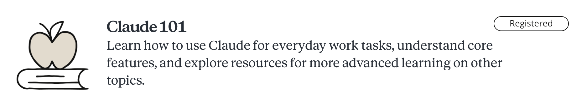
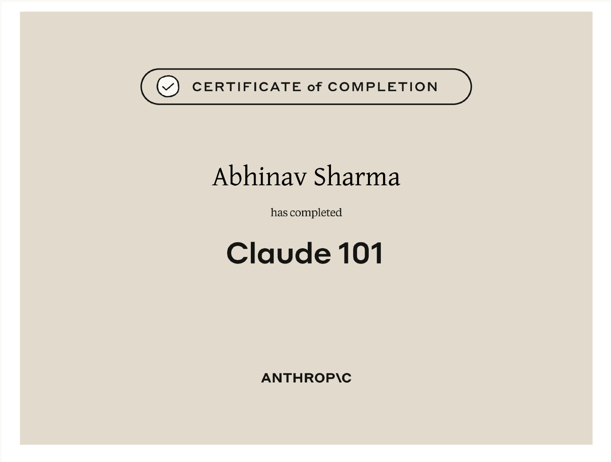

# Anthropic Education's Claude 101 and AI Fluency: Framework and Foundations course

> All rights reserved to Anthropic. This is just my progress depicting completion of the course and quick notes for others taking it.

## Claude 101

### Certificate

#### [Meet Claude](claude101/README.md#meet-claude)

- What is Claude?
  - Key Takeaways
  - Understanding Claude's Capabilities
  - Ways to Access
  - Reflection
- First Conversation with Claude
  - Key Takeaways
  - Iterating Responses
  - Personalizing
- Getting Better Results
  - Common Challenges & How to Fix Them
  - The Iteration Mindset
  - What is AI Fluency?
  - Evaluating Claude for Workflows
- Desktop App: Chat, Cowork, Code
  - Navigation
  - Reflection

#### [Organizing Work and Knowledge](claude101/README.md#organizing-work--knowledge)

- Introduction to Projects
  - Getting Started with Projects
  - Key Takeaways
  - What are Projects & When to Use Them
  - Reflection
- Creating with Artifacts
  - What are Artifacts?
  - Creating Your First Artifact
  - Reflection
- Working with Skills
  - What are Skills
  - Skills vs Projects
  - Reflection

#### [Expanding Claude's Reach](claude101/README.md#expanding-claudes-reach)

- Connecting Tools
  - Key Takeaways
  - What are Connectors
  - Reflection
- Enterprise Search
  - What is Enterprise Search?
  - Reflection
- Research Mode for Deep Dives
  - Key Takeaways
  - What is Research
  - Reflection

#### [Putting it all Together](claude101/README.md#putting-it-all-together)

- Use Cases by Role
- Other Ways to Work
  - Summary
