# Introduction to AI Fluency

### Key Takeaways

- **not the tech itself** → it's about humans, & how we collaborate with AI systems
- AI = **trusted creative/problem-solving partner**, not a "next-level spell-checker"
- Goal: approach AI possibilities confidently & capably → fast-moving field needs a **fundamental framework**, not chasing the next prompting fad

- **AI Fluency** = ability to engage with AI effectively, efficiently, ethically & safely
  - Not just technical definitions/prompting tips (those go stale fast)
  - Core shift: learn to **think with AI**, not just about AI
  - Context: AI went from niche tech → daily-use systems (school/work/home) → fast
    - Creates opportunity _and_ uncertainty: orgs adopting without strategy, users frustrated by systems they don't understand, growing gap between _possible_ vs _comfortable/intuitive_
    - This course = bridge that gap

- **AI Fluency Framework** = model for human-AI interaction, built on **4 core competencies ("the 4Ds")**:
  - **Delegation** → when should humans vs. AI do the work?
  - **Description** → how do we communicate clearly with AI?
  - **Discernment** → how do we evaluate AI's output?
  - **Diligence** → how do we keep AI use responsible, transparent & accountable?

- Most AI training = tactical only (prompts, settings, tools) → outdated quickly
  - AI Fluency instead builds **core competencies & deep understanding** → durable, future-proof readiness

### Reflection

- What challenges have you hit trying to get specific outcomes from AI?
- What AI-collaboration possibilities excite you most?
- What do you hope to gain from this course?

---

# The AI Fluency Framework

## Why do we need?

### Key Takeaways

- **AI fluency gap**: having access ≠ being fluent → frustrated interactions, unclear prompts, privacy concerns = signs of the gap
- **AI Fluency** = practical skills + knowledge + insights + values that adapt as tech evolves → interact effectively, efficiently, ethically & safely; maximize output without wasting effort or compromising privacy/security

- **3 Primary Ways to Engage with AI**:
  - **Automation** → AI executes a specific task you define
    - _e.g. summarize doc, draft email, plan itinerary_ → works well with clear outcome; harder when you're unsure what you want
  - **Augmentation** → you + AI collaborate as creative/problem-solving partners (AI doesn't do the work _for_ you → helps you do it _better_)
    - _e.g. developing a stuck story character by bouncing ideas, refining dialogue; working through a complex app architecture problem_ → best for non-straightforward solutions needing exploration
  - **Agency** → you configure AI to work independently on your behalf; set knowledge/behavior patterns, not just specific tasks
    - _e.g. auto-categorize incoming emails by urgency + draft responses; dynamic interactive website/game character_ → you're the director setting vision, not a script-writer giving exact directions

- None is inherently better → serve different purposes; can use all three in one project
- **Augmentation & Agency** best leverage AI's unique capabilities → most creative/effective solutions
- Shift: AI = not just a _tool_ but also a _medium_, _partner_, _co-creator_ → we need new skills & roles too

## The 4D Framework

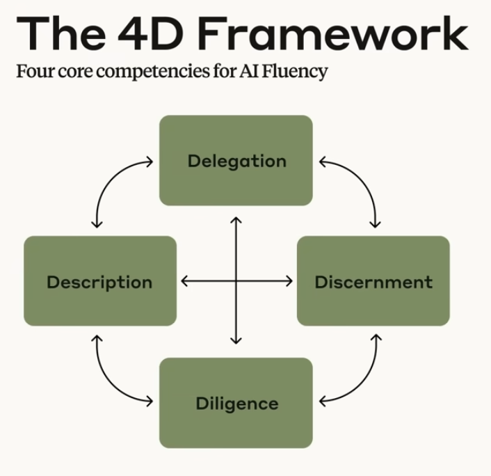

### Key Takeaways

- 4 core competencies that apply across all 3 modes (Automation/Augmentation/Agency); not tied to specific tools → durable & future-proof

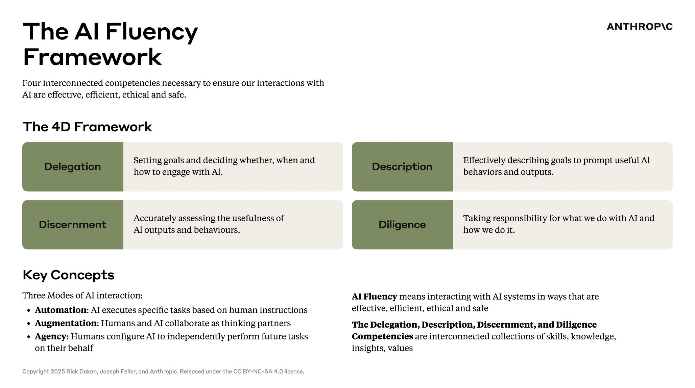

- **Delegation** → thoughtfully deciding what to do yourself vs. with AI
  - Big-picture thinking: what's the goal? What work should be human vs. AI?
  - _e.g. research project: AI reviews lengthy docs/data; you discuss implications & own critical analysis & conclusions_
  - Requires: understand your goal; know AI's strengths/limits; strategically divide the work
  - Not just offloading tasks → clear vision + strategic fit of AI in your process

- **Description** → communicating clearly with AI
  - Context-rich > vague: "make me a logo" vs. specifying values/audience/colors/style
  - _e.g. AI as tutor: "don't give me the answer, help me work through it step by step"_
  - Cover: desired output format; how AI should approach the task; context/background AI needs; tone & behavior style
  - Goal: articulate needs so clearly that you _both_ are set up for collaborative success

- **Discernment** → evaluating AI output with a critical eye
  - _e.g. AI suggests a marketing strategy → assess: are facts accurate? does reasoning hold? does it align with brand/audience? does it move you forward?_
  - Ask: Is output useful & correct? Is AI taking the right approach? Is AI behaving as desired?
  - Draws on your own domain expertise → judgment you can't outsource
  - Most AI interactions = small **Description ↔ Discernment loops**: describe → evaluate → refine → repeat

- **Diligence** → ensuring responsible AI use
  - _e.g. AI for job descriptions/application review → how are you controlling for bias?_
  - Three pillars:
    - **Accuracy & responsibility** → verify info; protect sensitive data; own the output
    - **Honesty & transparency** → be clear about AI's involvement
    - **Ethical use & accountability** → willing to stand behind AI-assisted work
  - Critical for safe & ethical collaboration

### Exercises

- **Exercise 1: Apply the 4Ds** → pick one scenario, apply each D:
  - _Communication_: Marketing email campaign with AI
  - _Research_: AI-assisted dataset analysis for a paper
  - _Creative_: Collaborating on story character concepts
  - For each: Delegation (what's human vs. AI?), Description (what context does AI need?), Discernment (how do you evaluate output?), Diligence (transparency/ethics considerations?)

- **Exercise 2: Explore something you love**
  - Chat with Claude about a topic you know well (hobby, profession, favorite series)
  - Notice: when Claude enhances your thinking; when you need to correct it; when your expertise shapes how you evaluate its responses

- **Exercise 3: Learn something new**
  - Ask Claude to teach you an unfamiliar topic → no "right" way to prompt, just ask naturally
  - Notice: helpful explanations; concrete examples; natural back-and-forth; moments where you'd want to fact-check

### Reflection

- Which of the 4Ds are you most confident in? Which needs work?
- Recall a recent AI interaction → how might the 4D framework have helped?
- Which 4D skills would most enhance your work/personal projects?

---

# Deep Dive 1: What is Generative AI?

## Generative AI Fundamentals

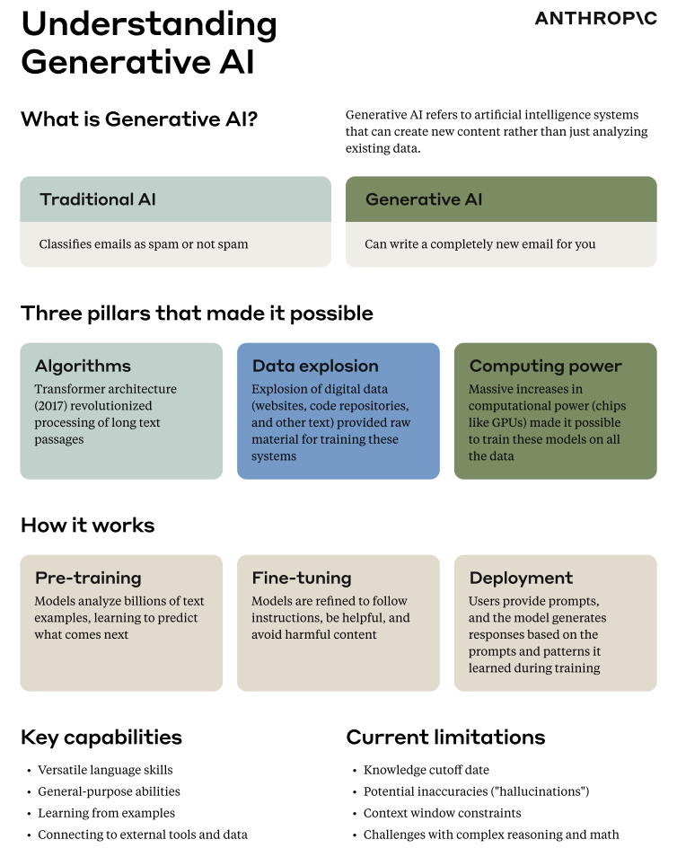

### Key Takeaways

- **Generative AI** = creates new content (vs. traditional AI which classifies/analyzes existing data)
  - _e.g. traditional AI: classify email as spam/not spam → generative AI: write you a new email from scratch_
- **LLMs** (e.g. Claude) = prominent type of GenAI
  - _Large_ = billions of parameters (mathematical values shaping how model processes info, like synaptic connections)
  - _Language_ = trained to predict & generate human language

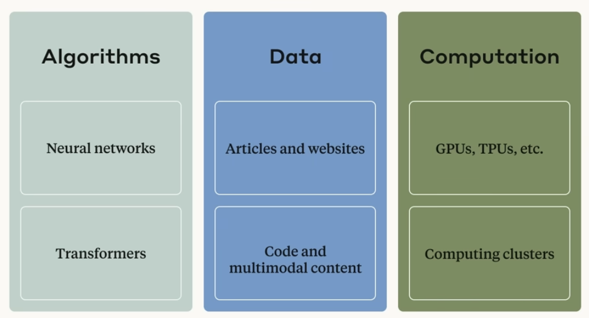

- **3 Pillars that enabled modern GenAI** (all converged at the right time):
  1. **Algorithmic breakthroughs** → **Transformer architecture (2017)**: game-changer; excels at processing text sequences while maintaining word relationships across long passages → critical for contextual language understanding
  2. **Explosion of digital data** → training material: websites, code repos, text corpora → models learn broad, nuanced understanding of language & concepts
  3. **Massive compute increases** → GPUs, TPUs, distributed clusters → made training large models on large data feasible

- **Scaling Laws** (↑ compute + data = ↑ intelligence): larger models trained on more data with more compute → predictable performance gains + _emergent capabilities_ (abilities no one programmed
  - e.g. step-by-step reasoning, adapting to new tasks with minimal instruction)

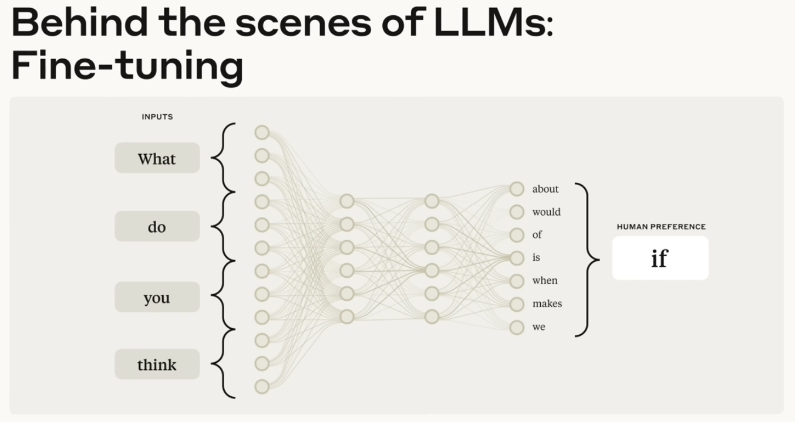

- **How LLMs work — under the hood**:
  - **Pre-training**: model reads billions of text examples → learns statistical relationships between words/phrases/concepts → builds a "map" of language & knowledge; trained by predicting what comes next → iteratively refines predictions
  - **Fine-tuning**: post pre-training → learns to follow instructions, give helpful responses, avoid harmful content; uses **human feedback** + **reinforcement learning** (rewards/penalties → more helpful, honest, harmless)
  - **Inference (deployment)**: your prompt = text the model reads & continues from, based on learned patterns; _not_ retrieving pre-written answers → generating new text statistically

- **Context window** = AI's working memory; includes prompts + responses + shared info; finite limit → content beyond window is inaccessible (first-in-first-out when exceeded); tools like web search extend reach beyond it

- **3 Characteristics making GenAI powerful**:
  1. Processes vast training data → learns complex, nuanced language/knowledge patterns
  2. **In-context learning** → adapts to new tasks from instructions/examples in your prompt, no retraining needed
  3. **Emergent capabilities** → new abilities arise from scale; not explicitly designed in

## Capabilities & Limitations

### Key Takeaways

- **Capabilities**:
  - Language mastery: drafting emails in your voice, summarizing reports, translating, explaining complex topics across domains
  - **Task flexibility**: same model shifts between poetry, birthday planning, quantum computing, business analysis → via conversation, no retraining
  - **Conversational memory**: tracks context within a session (_e.g. references your project deadline mentioned earlier_)
  - **Tool use**: connects to web search, file processing, external apps → extends beyond built-in knowledge

- **Limitations**:

  | Limitation                | What it means                                                                                                                                                                                                   |
  | ------------------------- | --------------------------------------------------------------------------------------------------------------------------------------------------------------------------------------------------------------- |
  | **Knowledge cutoff**      | No innate knowledge of events after training date (_e.g. model with Nov 2024 cutoff = like someone who went offline then_); needs web search for recent info                                                    |
  | **Hallucinations**        | Confidently generates plausible-but-wrong info; training doesn't verify every fact; LLMs generate from patterns, not retrieval (_e.g. a friend who retells a story with wrong details but complete confidence_) |
  | **Context window limit**  | Finite working memory; forgets oldest content first when exceeded; limits processing of very large docs/long conversations                                                                                      |
  | **Non-determinism**       | Same question → slightly different answers each time; probabilistic text generation; great for brainstorming, risky for consistency-critical tasks; controllable via **temperature** setting                    |
  | **Reasoning limits**      | Historically weaker on multi-step math/logic; newer **extended thinking / reasoning models** (step-by-step) showing strong progress                                                                             |
  | **Tool/data access gaps** | Can't help if it lacks access to a specific data source or tool (_e.g. brilliant colleague without access to your internal database_)                                                                           |

- **Improving limitations**: RAG (Retrieval Augmented Generation) connects models to external knowledge; tool use expanding; reasoning improving → but some limits will remain

- **Bottom line**: human + AI = complementary strengths
  - _Humans bring_: critical thinking, judgment, creativity, ethical oversight
  - _AI brings_: speed, scale, pattern recognition, vast information processing
  - Understanding what AI can/can't do = core AI fluency skill

### Reflection

- How does knowing about pre-training/fine-tuning change how you work with these systems?
- What ethical considerations arise from these capabilities & limitations?

---

# Delegation

## Closer Look at Delegation

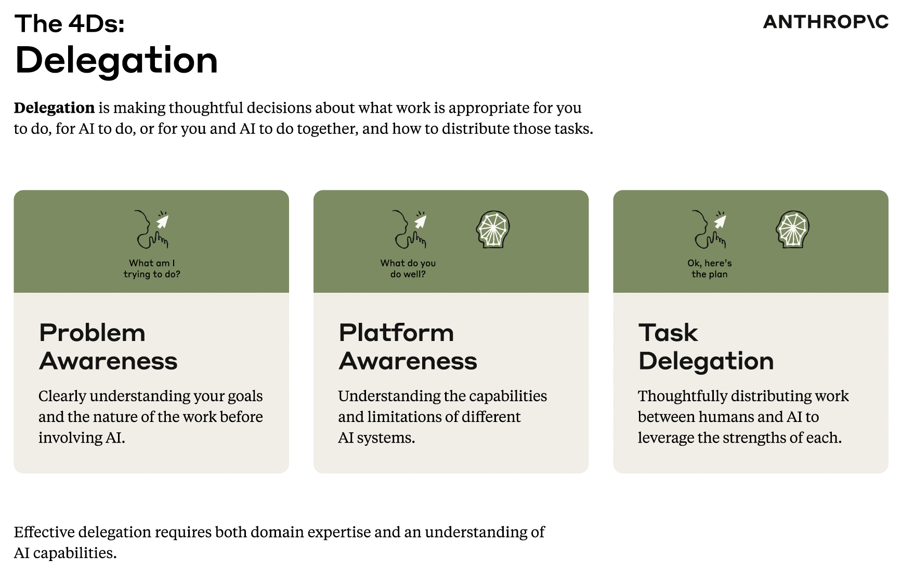

### Key Takeaways

- **Delegation** = deciding what work to do yourself vs. what to hand to AI → focused on _effective_ & _efficient_ AI use
- Requires: understanding your goal + what you & AI can each realistically do → break work into pieces → strategic decisions on who handles what (via automation / augmentation / agency)

- **3 Elements of Delegation**:
  1. **Problem Awareness** → clearly define your goals & understand the work needed _before_ involving AI
     - Ask: What does success look like? What am I trying to create/solve?
     - Ask: What kind of thinking/work is needed? Simple but time-consuming? Needs a thinking partner? Needs more data? Requires critical judgment?
     - ⚠️ AI fluency starts with _your_ expertise → without clear goals, even the best AI won't get you there; you'll struggle to direct it, evaluate outputs, or know when to step in
     - **Most effective AI collaborators = domain experts first, AI delegators second**

  2. **Platform Awareness** → working knowledge of available AI systems & their specific strengths/limits
     - Different systems offer vastly different capabilities; field evolves constantly
     - Ask: Which models perform best for my type of work? Which prioritize speed vs. depth? Accuracy vs. creativity?
     - Not about finding one perfect system → about knowing your options

  3. **Task Delegation** → strategically distributing work between human & AI
     - Ask: Which parts benefit from automation? Where does augmentation add more value than either alone?
     - Ask: Which judgment calls must stay human? What routine interactions can AI agents handle?
     - Outcome: informed split between → AI automates / human-AI collaborates / human only / AI agent acts

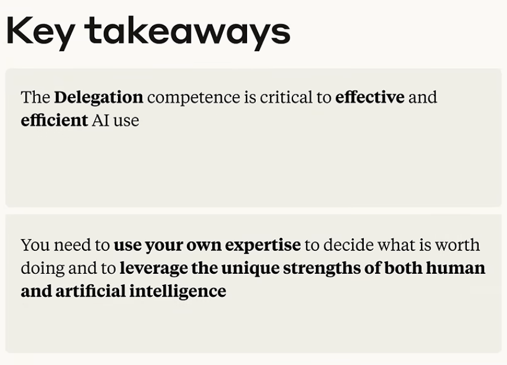

- **Recap**: Delegation = Problem Awareness + Platform Awareness + Task Delegation
- Effective AI collaboration ≠ handing over the wheel → thoughtful choices that leverage the unique strengths of both

### Exercises

- **Analyze tasks with an AI assistant**
  - Pick a small task (draft email, outline presentation, plan event)
  - Open Claude; share the task & ask for help building a delegation plan (_"Which parts should I delegate to AI vs. keep myself?"_)
  - Explore together (as a real back-and-forth conversation):
    - What does a good result look like?
    - What are the different bits of work needed?
    - Which require human expertise/creativity/judgment?
  - Output: simple delegation plan using both your strengths & AI's

### Reflection

- How might Delegation framework have changed a recent AI project?
- Which task types in your work would benefit most from AI collaboration?

## Project Planning & Delegation

### Exercises

- **Step 1: Choose your project** → medium-sized, multi-step; ~1 hour of work; genuinely interesting to you
  - _Communication_: presentation, blog series, proposal/pitch, bio + supporting materials
  - _Research_: emerging tech summary, dataset analysis, product comparison, historical investigation
  - _Creative_: short story outline (with characters/plot), website structure, product/service concept
  - _Learning_: structured learning plan, resource collection, tutorial/guide, study materials

- **Step 2: Project vision & goals**
  - Share idea with Claude → let Claude ask questions until you have a solid vision
  - Define: what does success look like? What makes this project valuable/meaningful?

- **Step 3: Task breakdown & delegation analysis**
  - With Claude, identify major tasks → for each, discuss (conversationally, not just statements):
    - Skills/knowledge/AI capabilities needed?
    - Which parts need uniquely human strengths?
    - Which parts leverage AI well?
    - Where does collaboration have the most impact?
  - Output: project plan with major tasks + delegation decisions
  - Save it → you'll revisit it for Description, Discernment & Diligence exercises later

### Reflection

- What insights came out of your planning conversation with Claude?
- What's the most challenging part of your delegation plan?
- What info/skills would help you delegate more effectively?

---

# Description

## Closer Look at Description

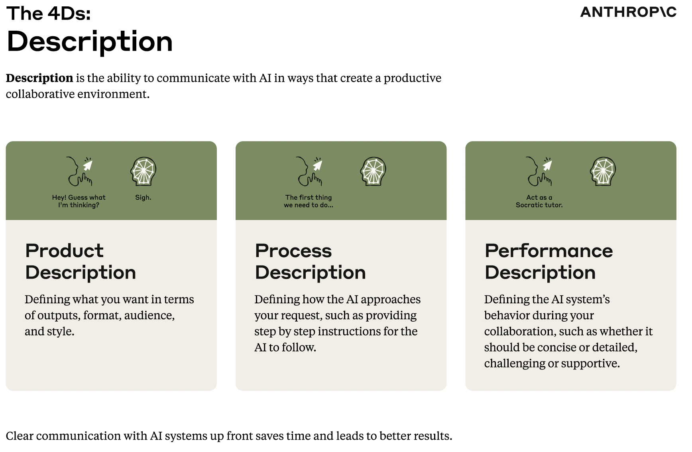

### Key Takeaways

- **Description** = communicating with AI → the core of most human-AI interaction
  - Goes beyond clever prompts → explaining tasks, asking questions, providing context, steering conversations, guiding reasoning
  - Goal: build a _thinking environment_ where both you & AI do your best work
  - Think of it as: bridging your intentions ↔ AI's capabilities

- **3 Components of Description**:
  1. **Product Description** → clearly define the characteristics of your desired output
     - AI can't read your mind → spell out every relevant detail
     - _e.g. "make dinner" vs. a detailed recipe with ingredients & steps_
     - Ask yourself: What's the context? What exactly should AI do? What format? Who's the audience? What style?
     - Set explicit requirements → don't make AI guess

  2. **Process Description** → guide the AI's thought process / _how_ it tackles the job
     - Sometimes _how_ matters as much as (or more than) _what_
     - _e.g. prefer a colleague uses your specific method → same with AI_
     - Provide: general guidance (like a manual), step-by-step instructions (like a cookbook), or worked examples ("here's how I'd do it")
     - Ask: What data should AI draw on? What issues, in what order? What style of analysis or workflow/technique?

  3. **Performance Description** → define the behavioral aspects of the interaction
     - AI ≠ database or vending machine → interactive system that behaves differently in different contexts
     - Ask yourself before each session: _What kind of thinking partner do I need right now?_
       - Narrowing to a specific answer vs. exploring possibilities?
       - Challenge my assumptions vs. follow my lead?
       - Expansive detail vs. concise?
       - Explain its reasoning vs. just give the answer?

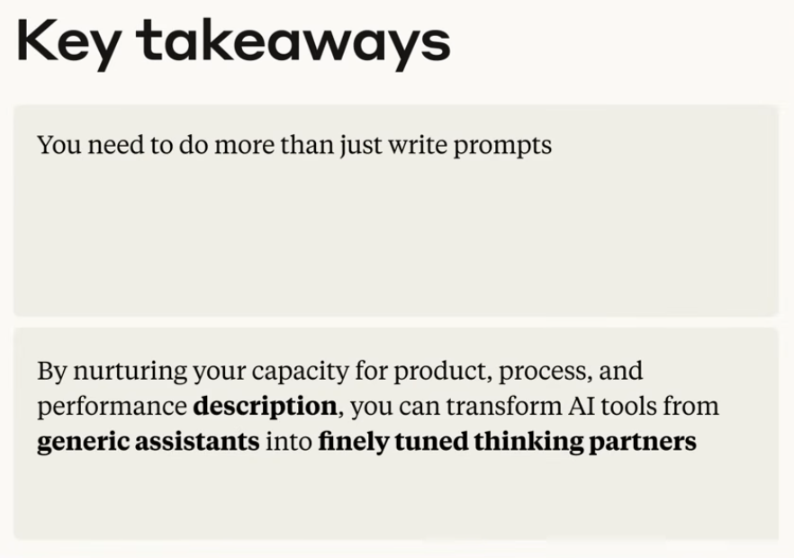

- **Recap**: Product + Process + Performance Description → transforms AI from generic assistant into a finely tuned thinking partner

### Exercises

- **Bad Prompt Makeover**
  - Ask Claude to give you some poorly written prompts to improve
  - Apply all 3 description components (product / process / performance) to each
  - Discuss before/after with Claude → ask for feedback on how your improved prompt would change its responses
  - After ~5 min: switch roles → give Claude bad prompts to fix; notice what info Claude adds & how it organizes it

### Reflection

- Which Description component (product / process / performance) do you most overlook?
- Recall a disappointing AI interaction — how might better description have changed the outcome?

---

# Deep Dive 2: Effective Prompting Techniques

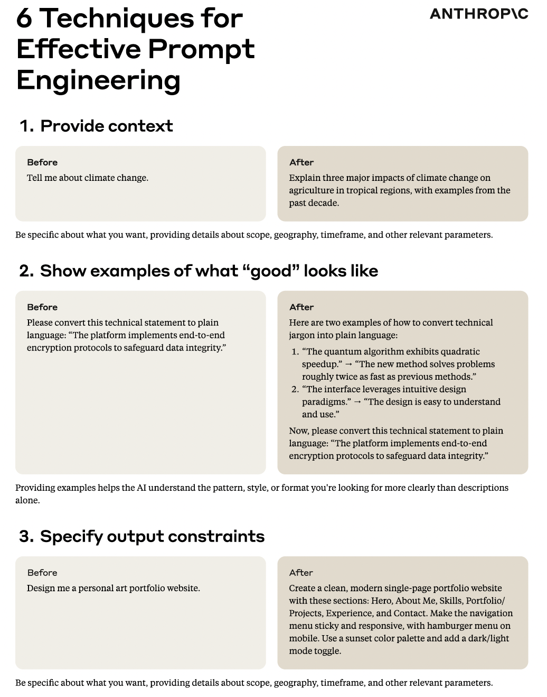
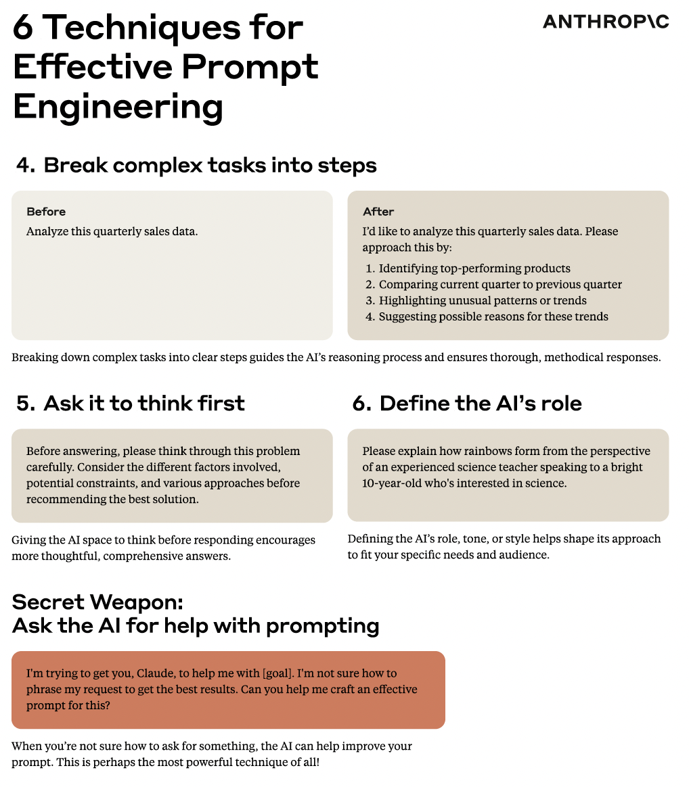

### Key Takeaways

- **Prompting** = description competency in practice; like briefing a capable new colleague who needs clear direction
- **Prompt engineering** = designing effective AI instructions; blends familiar human communication skills with AI-specific considerations
  - Human principles that carry over: be clear, provide context, give examples
  - AI-specific additions: be explicit about things humans infer naturally; respect context window limits; sometimes use specific formatting
  - ⚠️ Best practices evolve as models improve → experiment continuously

- **6 Prompting Techniques**:
  1. **Provide Context** → be specific about _what_ you want, _why_ you want it, _who you are_
     - ❌ "Tell me about climate change"
     - ✅ "Explain 3 major impacts of climate change on agriculture in tropical regions, with examples from the past decade. I'm preparing for a job interview at an ag research lab in Indonesia. I have an ecology degree but no climate change background. Write a summary to help me speak intelligently in the interview."
     - Add: your knowledge level, purpose, how you'll use the output

  2. **Offer Examples** → show, don't just tell (_few-shot / n-shot prompting_)
     - Try without examples first; add only if you need a specific style that's hard to describe
     - _e.g. give 2 sample jargon → plain-language conversions before asking Claude to convert a new one_
     - Cover diverse cases in your examples so Claude grasps the full pattern
     - Also specify output constraints here: format, length, coding language, design colors, etc.

  3. **Specify Output Constraints** → detail exactly what the output should look like
     - _e.g. "Create a single-page portfolio site with smooth scrolling, sticky nav, hamburger menu on mobile, sunset color palette, dark/light mode toggle"_
     - Removes ambiguity → Claude structures response to match your expectations

  4. **Break Complex Tasks into Steps** → list sub-steps to guide Claude's process (_chain-of-thought prompting_)
     - _e.g. instead of "analyze this sales data" → "1. identify top-performing products 2. compare to previous quarter 3. highlight unusual trends 4. suggest reasons"_
     - Not always needed for simple tasks; reasoning/extended thinking models increasingly self-step → but you can still steer to align with your domain expertise
     - More variance in execution = more reason to spell out your process

  5. **Give AI Space to Think First** → prompt Claude to reason before responding
     - _e.g. "Before answering, think through the problem carefully → consider factors, constraints & approaches before recommending a solution"_
     - Think first ≠ act then explain → order matters for quality
     - Side benefit: seeing AI's reasoning reveals where to refine your description

  6. **Define Role, Style or Tone** → tell Claude who to be
     - _e.g. "Explain rainbows from the perspective of an experienced science teacher speaking to a curious 10-year-old"_
     - _e.g. "As a UX design expert, review this wireframe & suggest 3 improvements for navigation & accessibility"_
     - Can specify a persona (_e.g. "explain this like Richard Feynman"_) or communication style

- **Secret Weapon: Ask Claude to Help With Your Prompt**
  - When unsure how to phrase a request → describe your goal & ask Claude to write or improve your prompt
  - _e.g. "I'm trying to get you to help me with [goal]. I'm not sure how to phrase it for best results. Can you help me craft an effective prompt?"_
  - Performance varies across models → good reason to experiment with delegation across different AI systems

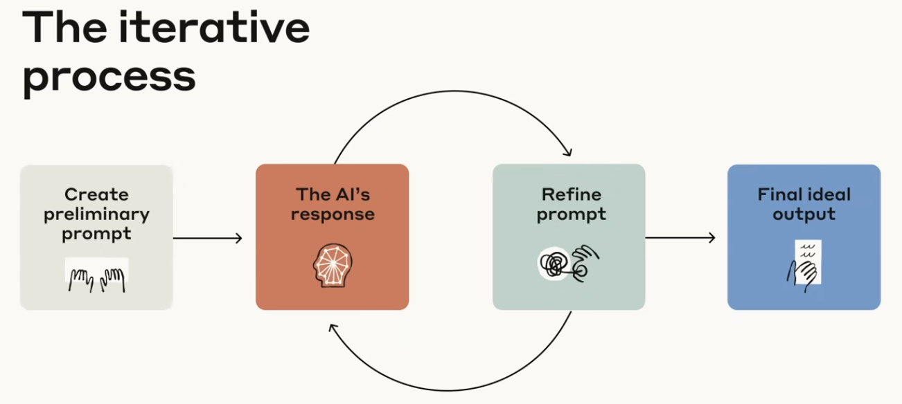

- **Prompting is iterative** → first attempt rarely perfect; refine by:
  - Adding specificity/context
  - Adding examples
  - Breaking into smaller steps
  - Trying a different technique or combination

- **Other useful moves**:
  - Ask for variations → "give me 3 different versions"
  - Request different formats → "present this as an interactive artifact instead of a paragraph"
  - Check confidence → "how confident are you in this answer?"
  - Reset entirely → fresh conversation often beats trying to fix a derailed one

- **Patterns that consistently work** ✅:
  - Start with a clear task overview
  - Include output format specs & examples
  - Detail specific constraints/requirements
  - Provide rich, relevant background

- **Common mistakes** ❌:
  - Assuming Claude reads your mind
  - Overloading one prompt with unrelated tasks
  - Being vague about what success looks like
  - Not giving feedback on previous responses

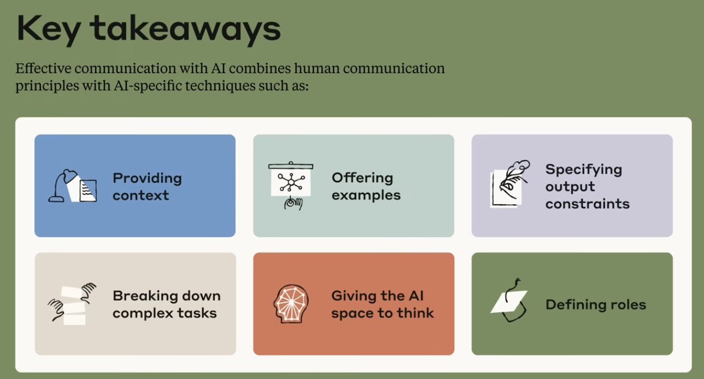

- **Recap**: 6 techniques + secret weapon = solid description toolkit; underlying communication principles stay relevant even as specific techniques evolve with models

### Reflection

- Which of the 6 techniques would most enhance your current AI interactions?
- Recall a disappointing AI interaction — which techniques might have improved it?
- How do these techniques connect to the Description competency in the 4D Framework?

---

# Discernment

## Closer Look at Discernment

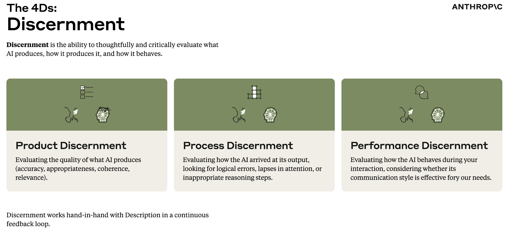

### Key Takeaways

- **Discernment** = your quality control system for AI collaboration; critically evaluate AI's _outputs_, _process_ & _behavior_
  - Flip side of Description: Description = communicate what you want → Discernment = judge whether you got it
  - Requires: **domain expertise** (know enough to judge quality) + **understanding of AI's typical shortcomings**
  - Even advanced AI can make reasoning errors, produce factual mistakes, or behave unexpectedly → discernment is your safeguard

- **3 Components of Discernment**:
  1. **Product Discernment** → judge the quality of AI's output
     - Ask: Is it factually accurate? Appropriate to audience/purpose? Coherent & well-structured? Does it meet my requirements? Does it add value/solve the problem?

  2. **Process Discernment** → judge the quality of AI's problem-solving approach
     - Watch for: logical errors; lapses in attention; inappropriate steps; fixating on one detail/interpretation; circular reasoning
     - _e.g. while expanding one of five outline options, you notice rejected ideas being quietly reinserted by AI across rounds of iteration_
     - Ensures you & AI stay in sync throughout; critical for complex tasks where the correct answer isn't immediately obvious

  3. **Performance Discernment** → judge how well AI interacts with you _while_ doing the work
     - Process = the work being done; Performance = how AI engages with you during that work
     - Ask: Is there a better communication mode for greater productivity? Is it providing info helpfully? Does it respond well to feedback? Is the interaction efficient or unnecessarily complex?
     - _e.g. is AI asking too many questions when you need concise answers? Too brief when you need depth?_

- **Closing the loop → giving feedback**:
  - When discernment flags a problem → better **description** is usually the fix:
    - Specify what the problem is
    - Explain _why_ it's a problem
    - Provide concrete suggestions for improvement
    - Revise your instructions or examples
  - Sometimes the fix is rethinking **delegation** → wrong tool or wrong approach entirely

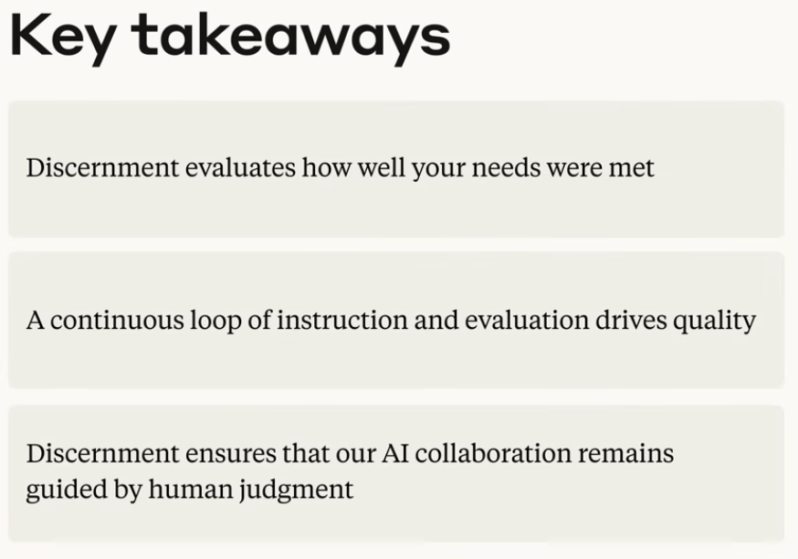

- **Recap**: Product + Process + Performance Discernment = continuous instruction → evaluation loop with Description; human judgment remains central throughout

### Exercises

- **Expert Discernment: Evaluating AI in Your Domain**
  - _Goal_: practice all 3 discernment types using a topic you know well (from Lesson 2, Exercise 2)
  - **Step 1**: Recall your expert topic from earlier
  - **Step 2**: Ask Claude for 3 different explanations/analyses of one specific aspect
    - _e.g. photography → 3 explanations of depth of field; cooking → 3 analyses of fermentation techniques_
  - **Step 3**: Apply expert discernment to each explanation:
    - _Product_ → most accurate? any factual errors? appropriate detail level?
    - _Process_ → logical reasoning? gaps in analysis? appropriate concept connections?
    - _Performance_ → attentive to your question? terminology appropriate? tone & style clear?
  - **Step 4**: Give feedback → tell Claude specifically why the strongest works; why the weakest falls short; co-create an improved version
  - **Step 5**: Reflect (in the same chat):
    - What expertise let you spot strengths/weaknesses?
    - How would someone without your knowledge struggle to discern quality here?
    - What does this reveal about domain knowledge & effective discernment?

### Reflection

- Which Discernment type (Product / Process / Performance) do you find hardest to apply, & why?
- How do Discernment & Description work together as a loop?
- What signals suggest an AI output needs closer scrutiny?

---

# The Description-Discernment Loop

### Exercises

- **Exercise: Project Execution with Description-Discernment Loops**
  - Put Description & Discernment into practice using the project planned in Lesson 5

  - **Step 1: Review your project plan**
    - Pull up Lesson 5 project plan → revisit delegation decisions (human / AI / collaboration)
    - Refine if needed based on what you've learned since

  - **Step 2: Prepare your Description approach** → before executing, plan across all 3 types:
    - _Product_: What outputs do you need? Format, style, length, detail level?
    - _Process_: How should Claude approach each task? Specific methods, frameworks, steps?
    - _Performance_: What collaborative behavior? Concise vs. detailed? Challenging vs. supportive? Ideas vs. analysis?

  - **Step 3: Execute using Description ↔ Discernment loops** → repeat for each task:
    1. **Describe** → Product (what), Process (how), Performance (engagement style)
    2. **Discern** → Product (output quality), Process (approach quality), Performance (interaction quality)
    3. **Refine** → give specific feedback; adjust description; iterate until satisfied
    4. **Integrate** → add your own expertise/judgment; make final keep/modify/discard calls; own the output

### Reflection

- What description patterns led to the best outcomes?
- Which required more effort → Description or Discernment? Why?
- How did actual execution compare to your Lesson 5 plan? What adjustments did you make?

---

# Diligence

## Closer Look at Diligence

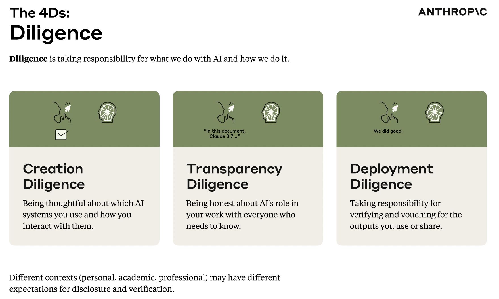

### Key Takeaways

- **Diligence** = the ethical & safety dimension of AI fluency; while the other 3Ds focus on effectiveness/efficiency, Diligence focuses on _responsible, transparent & accountable_ AI use
  - Core question: not just _can_ I do this with AI, but _should_ I, and _how_?
  - AI interactions don't exist in a vacuum → consider broader context & implications
  - _Analogy: driving isn't just about getting from A→B efficiently → you follow traffic rules & consider other road users_

- **3 Components of Diligence**:
  1. **Creation Diligence** → be critical & intentional about _which_ AI systems you use & _how_
     - Ask before starting: How is this system trained? What data was used? Who owns the data I'm inputting? Who has access once shared? How am I protecting privacy/security? Does this align with my personal/professional values & org policies?
     - _e.g. before sharing sensitive company info with an AI → check the service's data protection policies & whether your org permits it_

  2. **Transparency Diligence** → be open & accurate about AI's role with relevant stakeholders
     - Different contexts (personal, academic, creative, professional) have different disclosure expectations → your responsibility to know & meet them
     - Ask: Who needs to know about AI's role? How & when should I communicate it? What level of detail is appropriate?
     - _e.g. if AI helped draft a team proposal → tell colleagues which parts were AI-assisted → honest collaboration, everyone on the same page_
     - Transparency = maintaining trust & respect; people have a right to know when AI significantly shaped content or decisions affecting them

  3. **Deployment Diligence** → take informed responsibility for AI outputs you use or share
     - You — not the AI → are ultimately accountable for accuracy & appropriateness of anything you put out
     - Before sharing: verify facts; check for bias; ensure accuracy; check usage/IP rights; apply any other context-specific checks
     - _e.g. journalist using AI to draft an article → must verify every fact & source to the same standard as if written entirely themselves_

- **Navigating diligence in practice**:
  - Develop personal AI guidelines aligned to your own ethics & values
  - Know your org's policies, professional standards & industry codes of conduct
  - ⚠️ Legal & regulatory frameworks around AI are still emerging → staying informed is itself part of diligence

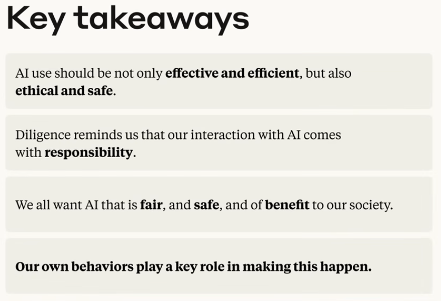

- **Recap**: Creation + Transparency + Deployment Diligence = complete Diligence competency → ensures AI use is not just effective & efficient, but also **ethical & safe**
- We all want fair, safe, beneficial AI → our own behaviors play a key role in making that happen

### Exercises

- **Exercise: Creating a Diligence Statement**
  - _A diligence statement = transparent acknowledgment of AI's role in your work + your assertion of responsibility for the output_
  - Example template: _"In creating this [doc/project], I collaborated with [AI] to assist with [tasks]. All AI-generated content underwent thorough review. The final output reflects my understanding & expertise. While AI assistance was instrumental, I maintain full responsibility for accuracy & presentation."_

  - **Step 1**: Understand what a diligence statement is (see template above)
  - **Step 2**: Reflect on your course project across all 3 types:
    - _Creation_: Which AI did you use & why? What data did you share? Any privacy/security/ethics concerns?
    - _Transparency_: Who's the audience? What disclosure expectations do they have? How specifically did AI contribute?
    - _Deployment_: How did you verify accuracy? How does the output meet your standards? What responsibility are you claiming?
  - **Step 3**: Draft your statement with Claude → share Step 2 reflections + past project conversations → collaborate to write a statement covering: AI systems used; how AI contributed; your review process; your assertion of responsibility; any context-specific considerations
  - **Step 4**: Add the finished statement to your project (footer / appendix / metadata)

### Reflection

- Which Diligence type (Creation / Transparency / Deployment) do you find most challenging & why?
- How does your Diligence approach change across contexts (personal / academic / professional)?
- How does acknowledging AI's role affect how others perceive your work?
- What ethical considerations arose during your project that you hadn't anticipated?
- What personal guidelines will you develop for responsible AI collaboration going forward?

---

# Conclusion

### Key Takeaways

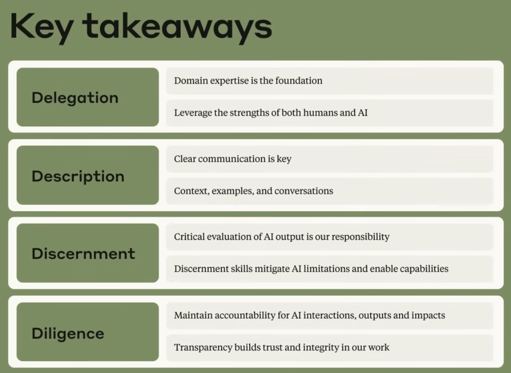

- AI fluency = continuously applying the 4Ds together: **Delegate** work strategically → **Describe** needs clearly → **Discern** output quality → **Diligence** throughout

### Exercises

- **Exercise 1: Discuss the AI Fluency Course with Claude**
  - Starter prompts (upload the framework for context):
    - Apply to your context → _"I've completed an AI Fluency course covering the 4Ds. Let's discuss how they apply to [my degree/job/field]."_
    - Future-facing → _"How might the AI Fluency Framework evolve as AI advances? What new competencies might emerge?"_
    - Self-assessment → _"Based on our conversation, which of the 4Ds do I seem to understand well & which need development?"_
    - Exercise review → _"Here's [a course exercise]. Let's analyze it to improve my competencies."_

- **Exercise 2: Build a Personal AI Policy** → co-create with Claude your own responsible AI guidelines covering:
  - When & how you'll use AI across different contexts
  - Boundaries for sensitive/confidential information
  - Quality control standards for AI-assisted work
  - Ethical issues most relevant to your field
  - Decision-making criteria for ethical dilemmas
  - How different stakeholders might be affected by your AI use
  - Disclosure approach for different contexts
  - Templates for attribution & transparency statements
  - Criteria for when more detailed disclosure is warranted

### Reflection

- The exercises above are the reflection → consolidate learning & connect to your ongoing development.
