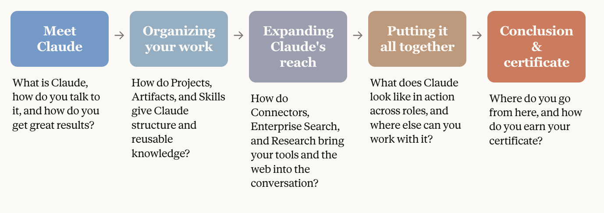
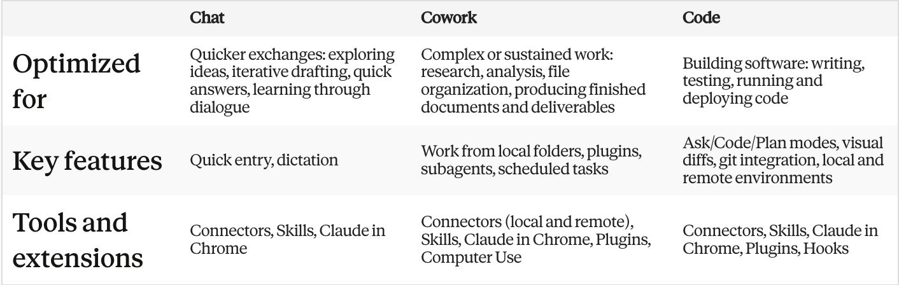
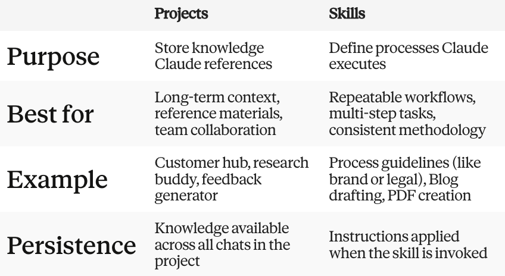
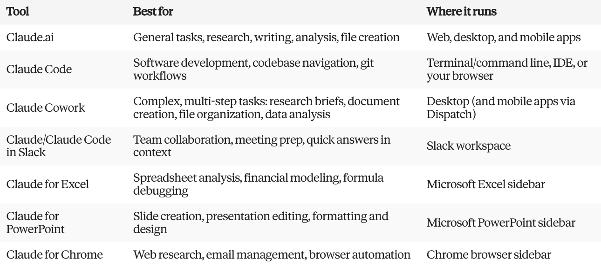

# Roadmap

# Meet Claude

## What is Claude?

### Key Takeaways

- AI thinking partner; more than a chatbot
- **Constitutional AI** → helpful, harmless, honest; avoids discriminatory/unethical outputs; aligns with human values
- **Steerable & collaborative** → takes direction on personality, tone & behavior → desired output with less effort, fewer harmful outputs
- Cross-platform sync
- Common tasks: summarization, search, creative/collaborative writing, Q&A, coding, complex problem-solving

### Understanding Claude's Capabilities

- **Writing & content creation** → social media, emails, reports; iterates on structure & clarity
- **Research & analysis** → largest context window
  - 200K+ tokens (~500 pages) standard; 1M+ on Pro/Max/Teams/Enterprise (supported models)
- **Coding** → one of greatest strengths; write, debug, explain across multiple languages
- **Problem-solving & reasoning** → complex cognitive tasks, math, strategy
  - Opus & Sonnet: hybrid models → near-instant OR extended thinking (step-by-step, deeper analysis)
- **Learning** → adapts to learning style/pace; learning mode guides reasoning rather than giving answers
  - [use case gallery](https://claude.com/resources/use-cases)

### Ways to Access

- **Claude.ai** → questions, brainstorming, documents, research
- **Claude Code** → agentic coding, file manipulation, commands, commits
- **Claude & Slack** → @claude in any channel; searches workspace channels, DMs & files for context
- **Claude for Excel** → read/analyze/modify workbooks; formulas, error debugging, multi-tab navigation

### Reflection

What tasks in your current work might benefit from having Claude as a thinking partner?

## First Conversation with Claude

### Key Takeaways

- Claude's intelligence + your context/expertise = amplified output
- **Artifacts** → turn ideas into shareable apps, tools, or content
- Prompt like a coworker: naturally, concisely, conversationally
- **Good prompt = Stage + Task + Rules**
  - _Stage_: role, objectives, context
  - _Task_: action (write, analyze, build…)
  - _Rules_: tone/style, examples
  - _Example_: "I'm the marketing lead at an indie streaming startup preparing a Series A pitch. Research the indie film streaming market-trends, competitors, growth opps. Use cited web research; structure as a ≤5-page report with exec summary, market analysis, competitive landscape & growth opportunities."
- Attach context sources: company docs, project files, research
- **Supported file types**: PDF, CSV, DOCX, TXT, HTML, ODT, RTF, EPUB, JSON, XLSX; images (PNG, JPEG)

- **Model choice**:
  - _Opus_ → complex, multi-step tasks (e.g. financial analysis); hybrid reasoning
  - _Sonnet_ → everyday use; balanced capability & cost
- **Extended thinking** → deeper analysis, higher latency; best for planning, trend analysis, math/coding
- **Research mode** → multi-source, cited reports (5–45 min)
- **4D prompting**: Delegation → Description → Discernment → Diligence
- **Preferences**: Settings > General → applied to every response

### Iterating Responses

- Conversations are iterative; chain bite-sized prompts
- **Ask follow-ups**: "expand on point 2", "make it more concise"
- **Give feedback**: "good, but too formal → make it conversational"
- **Redirect**: "I meant X not Y, let me clarify…" or restart fresh
- **Edit prompt** (pencil icon) → refine rather than add new message

### Personalizing

- **Memory** → auto-saves role, preferences, past decisions, working style; editable anytime
- **Styles** → concise/formal/explanatory presets, or define your own

## Getting Better Results

### Common Challenges & How to Fix Them

| Problem             | Fix                                                                           |
| ------------------- | ----------------------------------------------------------------------------- |
| Too generic         | Add audience, role & constraints                                              |
| Wrong length        | Be explicit: "2-paragraph summary", "under 100 words"                         |
| Wrong format        | Show don't tell: "bullet points with bold headers" or give an example         |
| Confident but wrong | Verify high-stakes facts; ask for sources/confidence level; enable web search |
| Wrong tone          | Name the tone + provide a writing sample                                      |

### The Iteration Mindset

- First prompt = start of conversation, not a one-shot request
- Review → identify what's working → refine
- Specific feedback: ❌ "make it shorter" → ✅ "cut first two paragraphs, sharpen conclusion"
- If conversation derails → start fresh with a clearer prompt

### What is AI Fluency?

Judgment to use AI effectively across situations. **4D Framework**:

- **Delegation** → decide what humans vs. AI should do; understand goals & AI capabilities
- **Description** → clearly define outputs, guide process, specify behaviors
- **Discernment** → critically evaluate outputs for quality, accuracy & appropriateness
- **Diligence** → use AI responsibly; maintain transparency & accountability

> _Prompt structure (Stage/Task/Rules) → Description; Troubleshooting → Discernment & Diligence_

### Evaluating Claude for Workflows

- **Evals** = systematic tests to build intuition on Claude's task performance
- Run simple evals to: find where Claude adds most value, identify where more context is needed, build confidence for recurring tasks
- **Simple eval process**:
  1. Gather 5–10 real examples of a recurring task
  2. Write test prompts (include natural context)
  3. Compare outputs → key info? tone? gaps?
  4. Refine prompts, add examples, flag where human review is essential

- **Delegation–Diligence loop** (for data analysis trust):
  1. Pick a recurring analytical task
  2. Find past data where you already know the answer
  3. Have AI reproduce your analysis; compare systematically
  4. Note gaps → refine description → test again
  5. If AI matches known results → validated for future use; if not → don't delegate

  > _Rio (program director) tested AI on quarterly attendance/employment data he'd already analyzed manually. AI correctly found the attendance–placement correlation but missed a combined-program insight. After prompting AI to consider program type, it caught the error. Rio noted: always specify program type in future prompts. He also found AI couldn't do cohort analysis without enrollment dates in the data. Result: validated confidence with clear documented rules, not guesswork._
  - Validation ≠ end of accountability. Still check results make sense & be transparent about AI's role.

## Desktop App: Chat, Cowork, Code

### Navigation

- **Chat** → same as Claude.ai, runs natively on desktop
  - _Quick entry_: double-tap Option (Mac) → compact overlay on top of any app
  - _Screenshots/window sharing_: capture screen so Claude sees exactly what you see
  - _Dictation_: speak instead of type; useful for thinking out loud
  - _Connectors_: link local tools & services
  - _When to use_: unfamiliar dashboard → screenshot + ask; between meetings → voice draft an outline; fragmented notes → add connector, ask Claude to synthesize across tools

- **Cowork** → agentic tool; give a goal + tools → Claude does the work
  - Runs locally; independent work; spins up sub-agents; sustains long tasks
  - _Folder access_: point to a folder → Claude reads, works, saves back
  - _Scheduled tasks_: recurring tasks on a schedule (daily briefing, weekly roundup); catches up if app was closed
  - _Sub-agents_: parallel background workers for complex multi-source tasks → one finished deliverable
  - _Dispatch_: continue Cowork tasks from mobile (needs desktop app open + awake)
  - _Projects_: group related tasks with shared files, context, instructions & memory (local to desktop)
  - _Browser use_: Claude in Chrome → navigate sites, interact with pages, pull data into tasks
  - _Computer use_: Claude navigates desktop directly (click, type, open apps) when no connector exists; priority order: connectors → Chrome → screen interaction; blocklist available
  - _Plugins_: add capabilities (live financial data, internal knowledge base, compliance frameworks)
  - _Protected environment_: sandboxed to folders you share; can't access anything outside them
  - _When to use_: cross-tool query ("review pricing decisions across Slack, email & notes, update Q3 deck"); multi-tab research (competitor pricing, reports → structured brief); large document sets (50+ files → summary memo); recurring morning admin → schedule it

- **Code** → agentic coding tool; reads codebase, writes/modifies code, runs commands
  - Visual diffs, built-in terminal, git version tracking
  - _Environments_:
    - _Local_: select folder → Claude works directly with files; can run a dev server
    - _Remote_: connect GitHub repo → cloud environment; sessions persist after app close
  - _Interaction modes_:
    - _Ask_: Claude proposes every change; you approve via visual diff before anything changes
    - _Code_: auto-applies file changes; checks before running terminal commands
    - _Plan_: outlines full approach first; plan viewer to review/revisit before touching code
  - Filter sessions by status (Active/Archived) & environment (Local/Cloud) from sidebar

### Reflection

- Which mode? → Chat, Cowork, or Code → fits each task you commonly use Claude for?
- Think of a recent multi-source project. How might Cowork have changed your workflow?

---

# Organizing Work & Knowledge

## Introduction to Projects

### Getting Started with Projects

- **Key Features**
  - Project knowledge = upload docs once → auto-considered in every chat within that project (no re-uploading)
  - Aligns responses with team's goals, terminology & background
  - Large projects auto-use **RAG** (Retrieval Augmented Generation) → handles content beyond normal limits
  - **Project instructions** → tailor tone/perspective/industry focus; apply to every chat
  - Claude for Work → share projects across org for collaboration
    - _e.g. brand team shares voice/tone guidelines project → everyone writes like a marketer_

### Key Takeaways

- Projects = **self-contained workspaces** → own memory, chat history, knowledge base & instructions
- Knowledge → upload once, referenced across all chats in project
- Instructions → set tone/expertise/style, applies project-wide
- Scale automatically → RAG mode kicks in near context limit → **up to 10x capacity**, same quality
- Claude for Work → shareable with teammates → shared context, instructions & knowledge

### What are Projects & When to Use Them

- Best for: reference knowledge, organizing related chats by topic, team collaboration on shared context
- Use when work is **ongoing** (not one-off):
  - Recurring reference material (notes, reports, historical data)
  - Consistent response rules (always formal, always cite sources, always use template)
  - Multi-person collaboration on same foundation

- **Creating Your First Project**
  - **Step 1 – Set up**: Sidebar → Projects → "+ New Project" → descriptive name + description (helps humans, not seen by Claude) → Create → star/archive/delete options → set visibility (private or org-shared)
    - _e.g. Name: "Brand Voice & Marketing Writing Assistant"; Description: helps team write content matching company voice across posts/emails/web copy_
  - **Step 2 – Add instructions**: "Instructions" panel → tells Claude how to behave project-wide. Good instructions cover:
    - Context (what the project is for)
    - Process (steps to follow, e.g. "outline first, then draft")
    - Tone/expertise/style ("professional but conversational, avoid jargon")
    - Specific rules ("always include CTA")
    - Can automate workflows ("when I upload a transcript, summarize using this template")
    - Save → applies project-wide, works alongside personal preferences/styles
  - **Step 3 – Build knowledge base**: Files menu (right side) → "+" to upload (PDF, DOCX, CSV, TXT, HTML…) or connect Google Drive
    - Upload: reference docs, background materials, example work, technical specs
    - 💡 Name files descriptively → Claude uses filenames to retrieve info (e.g. "Q4-2024-Brand-Guidelines.pdf" > "document1.pdf")

- **Large Knowledge Bases → RAG**
  - Auto-finds & uses most relevant parts of uploaded docs → no need to specify which file
  - Triggers near context limit → retrieves only relevant info instead of loading everything → **10x capacity**, same quality
  - Visual indicator shown when RAG-enabled; UX feels unchanged

- **Working Within a Project**
  - Every chat in project auto-uses knowledge base + instructions
  - **Permission levels**:
    - _Can view_ → read-only + discussion
    - _Can edit_ → modify instructions, update knowledge, manage members
    - _Owner_ → full control incl. sharing/visibility
  - **Sharing**: Open project → "Share project" → add by name/email (individually or bulk) or share with "Everyone at [org]" → notified via email, found under "Shared with me"

- **Example Projects**: Q4 Product Launch (specs, competitive analysis), Research Support (synthesize sources), Client Account Hub (brand guidelines + history), Event Planning (contracts, bios, attendee data), Job Description Generator (past JDs + team charters)
- **Other use cases**: bringing a product to market (ideation→launch tracking), content creation hub (consistency across platforms), educational course development, personal financial planning, home renovation management

- **Best Practices**
  - Start focused → expand later
  - Keep knowledge base current (outdated docs = outdated answers)
  - Write clear, specific instructions
  - Name files descriptively & group related files (Claude uses filename + proximity)
  - Reference docs by name in prompts to focus Claude's search

### Reflection

- What ongoing work could benefit from a dedicated project with persistent context?
- What documents do you keep re-uploading/re-explaining?
- Would shared team projects help your group?

## Creating with Artifacts

### What are Artifacts?

- **Artifacts** = standalone, interactive outputs in a dedicated window beside the chat (website, chart, downloadable doc) instead of buried in conversation
- Auto-triggered when content is:
  - Significant & self-contained (typically 15+ lines)
  - Likely to be edited/iterated/reused
  - Complex enough to stand alone
  - Something you'll reference later

### Creating Your First Artifact

- Just describe what you want → Claude decides if it warrants an artifact
  - _e.g. "flowchart of onboarding process", "interactive expense dashboard", "landing page design", "reusable project brief template"_
- If Claude doesn't auto-create one → explicitly ask: "Create this as an artifact"
- Artifact window controls:
  - **Toggle preview/code** view
  - **Copy** content for reuse elsewhere
  - **Download** as file
  - **View code** (underlying generation)

- **Sharing & Publishing**
  - _Copy/Download_ → personal use, share via other channels
  - _Share within org_ (Team/Enterprise) → stays internal, requires team auth
  - _Publish publicly_ (Free/Pro/Max) → link-accessible to anyone, no account needed
    - Only selected version goes public; chat stays private
    - Others can **"remix"** → open in their own Claude conversation to modify
    - Unpublish anytime; not indexed by search engines

- **Tips for Best Results**
  - Be specific (not "build a budget tracker" → "monthly tracker with category input, pie chart, over-budget warning")
  - Describe the end user → changes design choices
  - Iterate incrementally → one change at a time, easier to debug
  - If Claude responds in chat instead of artifact for something substantial → explicitly request artifact

### Reflection

- What recurring work could benefit from a reusable interactive artifact?
- Any processes that'd be clearer as a flowchart/diagram?
- What prototype/tool would help you test an idea quickly?

## Working with Skills

### What are Skills

- **Skills** = folders of instructions/scripts/resources Claude loads dynamically for specialized tasks → "expertise packages" for repeatable workflows
- Already powering Excel/PPT/Word/PDF file creation behind the scenes
- Custom Skills can codify entire workflows (quarterly variance analysis, brand review process, compliance checklist) → same rigorous steps every time

- **Types**:
  - _Anthropic Skills_ → built/maintained by Anthropic; doc creation (Excel/Word/PPT/PDF); auto-invoked for all paid users, no setup needed
  - _Custom Skills_ → built by you/org for specialized workflows (e.g. brand guideline application, meeting note structuring, data analysis workflows)

- **Enabling Skills**
  - Feature preview: Pro/Max/Team/Enterprise plans
  - Requires **Code execution & file creation** toggled on (sandboxed environment)
  - Settings > Capabilities → toggle on → scroll to Skills → enable individually
  - Enterprise → org Owner must enable Code execution + Skills first in Admin settings
  - Team → enabled by default org-wide

- **Using Skills in Practice**
  - Auto-selected by Claude based on your request → no manual triggering
    - _e.g. "Create an Excel tracker with formulas", "Turn meeting notes into a PPT", "Generate a PDF report", "Build a financial model with scenario analysis"_
  - Shown in Claude's chain of thought when invoked; output = downloadable file (or save to Drive)

- **File Execution** (working with actual files)
  - Claude works on slides, spreadsheets, contract redlines within a contained environment
    - _e.g. build investor deck narratives from Q4 financials, comps analysis vs peers, customize NDA with tracked changes + review comments_
  - Upload .xlsx/.pptx/.docx/.pdf → Claude edits/analyzes/creates (in Chat: creates a _new_ version, doesn't edit original in place)
  - Requires "Allow limited network access" toggle for external data sources

- **Security**
  - Only install custom Skills from trusted sources
  - Anthropic's built-in Skills = tested & maintained by Anthropic
  - Custom Skills you upload = private to your account
  - Review external Skill contents before use

- **Creating Custom Skills**
  - Built via conversation with Claude → no coding/manual file creation needed
  - Process:
    1. Start chat → describe desired skill (e.g. "skill for writing quarterly business reviews")
    2. Answer Claude's interview questions (what it should do, what good output looks like, example use cases)
    3. Upload reference materials (templates, style guides, examples)
    4. Save → Claude generates the structured skill file
  - Manage skills via **Customize tab** in sidebar → view, edit manually or via chat
  - Auto-invoked going forward for relevant tasks; ask Claude to edit/iterate anytime

### Skills vs Projects

> Projects store knowledge, Skills perform tasks

- _Projects_ = knowledge hubs → reference materials (specs, notes, research) used across conversations
- _Skills_ = procedural machines → encode steps/order/methodology for repeatable task execution
- Complementary: a Skill can pull from knowledge stored in a Project
  - Project = the **what** (information); Skill = the **how** (process)
  - _e.g. "customer call prep" skill pulls customer profiles from a project's knowledge base_

### Reflection

- What documents you create regularly could use built-in Skills?
- Any repetitive workflows that'd suit custom Skills?
- How might Skills change your approach to document creation & data analysis?

---

# Expanding Claude's Reach

## Connecting Tools

### Key Takeaways

- **Connectors** = assistant → informed collaborator; Claude works with your actual tools/data/context instead of starting from scratch
- Claude can **read & act**: search files, retrieve docs, analyze data, create content, update records, execute tasks (per permissions granted)
- **MCP (Model Context Protocol)** powers connectors → "USB-C for AI": one universal standard, any developer can build a connector, all work seamlessly with Claude
- **Two types**:
  - _Web connectors_ → cloud services (Google Drive, Notion, Slack, Asana)
  - _Desktop extensions_ → local apps via Claude Desktop app

### What are Connectors

- **Finding & connecting**: Directory at claude.ai/directory (tabs: Web / Desktop extensions), or "+" button → Connectors in chat
- **Setting up a Web Connector**: Find → Connect → Authenticate (login) → Grant permissions → Test ("Can you access my [tool]?")
- **Desktop Extensions** (Claude Desktop app only):
  - Enables: local file access, browser control, native app integration (e.g. Figma)
  - Install: Download Desktop app → Settings > Extensions → Browse → Install → follow setup steps

- **Using Connectors → practical prompts**:
  - _Project mgmt_ (Asana/Linear/Jira) → "highest priority tasks this week", "create task for X"
  - _Communication_ (Slack/Gmail) → "find the vendor contract thread", "draft reply to #marketing"
  - _Documentation_ (Notion/Drive/Confluence) → "search brand voice guidelines", "summarize last week's meeting notes"
  - _Business tools_ (Stripe/PayPal/Salesforce) → "revenue trends last quarter", "status of Acme Corp opportunity"

- **Security & Permissions**
  - _Scoped access_ → toggle individual permissions per app
  - _Claude sees what you see_ → only your own access level (e.g. your inbox, not your CEO's)
  - _Revocable anytime_ → disconnect via Claude settings or the service itself
  - Custom connectors → same rule as Skills: only install from trusted sources

### Reflection

- Which daily tools would be most valuable to connect?
- What copy-paste tasks could connectors automate?
- Would combining multiple connected sources save significant time?

## Enterprise Search

### What is Enterprise Search?

- Adds **"Ask {Org Name}"** to sidebar → like a pre-built Project for the whole org, knowledge base already loaded
- Unlike regular connector-enabled chats → purpose-built for info-gathering, with custom instructions set by Anthropic team

- **What can you ask?** (spans multiple sources / synthesizes org-wide info)
  - _Getting up to speed_ → "What happened while I was out?", "blockers on Platform project?"
  - _Policy & process_ → "remote work policy?", "how to submit expense report?"
  - _Research & analysis_ → "why do customers choose competitors?", "Q4 roadmap discussions"
  - _Onboarding_ → "how does auth system work?", "who handles billing system?"
  - _Performance/project tracking_ → "marketing campaign discussions", "key decisions from leadership meetings"
  - Searches across SharePoint, Slack, Gmail, Drive etc. → unified, **cited** response

- **Setup (two-step)**:
  - _Admin (Owner)_: enabled by default for Team/Enterprise orgs, but Owner must complete setup
    - "Ask Your Org" in sidebar → "Set up for your org" → connect Documents connector (Drive/SharePoint) + Chat connector (Slack/Teams) [Email optional] → "+ Add more" for extras → name it (becomes "Ask [Name]") → add description → Finish
  - _User_: starred "Ask {Org Name}" project appears in sidebar → click → guided onboarding → authenticate each service → start asking
    - More connectors enabled = more comprehensive results

- **Is it safe?** → Yes: only surfaces what you already have permission to access; conversations stay private; connected data not separately indexed/stored

### Reflection

- What questions to colleagues could Enterprise Search answer instead?
- Could it speed up onboarding/training?
- Which data sources matter most for your role?

## Research Mode for Deep Dives

### Key Takeaways

- **Research** = agentic, multi-search investigation (not single search) → explores question from multiple angles, decides next steps automatically
- **Speed**: most reports in 5–15 min (complex ones up to 45 min) vs. hours of manual work
- **Extended thinking auto-enabled** with Research → plans approach + gathers info, breaks complex requests into pieces
- **Citations** on every claim → easy to verify

### What is Research

- Turns Claude into a systematic investigator: explores from multiple angles, synthesizes web + connected integrations
- Think: a research assistant doing hours of work, compressed into minutes
- Best when you need more than a quick answer → multi-source synthesis & comparison

- **When to use Research**:
  - Comprehensive multi-source reports; in-depth web + integration analysis; comparative analysis (competitors/vendors); citation-backed reports
  - Good for: market analysis, complex project planning (offsites, launches), synthesizing email/calendar/docs, technical docs from multiple sources, briefings needing current verified info

- **Research vs. alternatives**:
  - _Web search instead_ → quick single fact, 1-2 sources, speed > depth
  - _Extended thinking instead_ → pure reasoning (math, code debugging, logic), no external info needed
  - _Enterprise Search instead_ → org-internal knowledge only (docs/Slack/emails), company-specific Qs

- **How Research works** (4 steps):
  1. **Plan** → extended thinking activates, breaks down request, identifies info needed
  2. **Multi-search** → searches build on each other, Claude decides what to investigate next, fills gaps
  3. **Synthesize** → compiles web + integrations (Gmail/Calendar/Drive) into organized report
  4. **Cite** → every claim links to source for verification

- **Using Research**: "+" button → select Research → enter prompt → submit → background progress indicators
  - ⚠️ Web search must be enabled for Research to work

- **Tips for effective prompts**:
  - Be specific about goals (not "tell me about EV market" → "analyze EV battery market: key players, tech trends, supply chain risks")
  - Specify structure/sections you want
  - Include constraints (budget, timeline, geography)
  - Ask Claude to help refine the Research prompt itself first

- **With connected integrations**: pulls from email/calendar/docs alongside web
  - _e.g._ "Summarize Project X across emails & Slack, then research industry best practices"; "Review next week's calendar & research each company I'm meeting"
  - Steer with: "Pull context from my Google Drive" / "Include insights from recent emails"
  - Can turn OFF web search → internal-only research across connected tools

### Reflection

- What research tasks require multi-source gathering in your work?
- How would Research + connected integrations change your workflow?
- What complex question have you been putting off due to research time?

---

# Putting it all Together

## Use Cases by Role

- Practical use cases organized by role → each links to a detailed Use Case Gallery guide (step-by-step)

- **General Professional Use** (cross-role/industry)
  - Project status reports → consistent stakeholder updates
  - Analyze user feedback patterns → insights from comments/surveys
  - Package brand guidelines as a skill → reusable Claude skill for brand standards

- **Sales** → deal prep, materials, competitive intel
  - Battle card library → competitive intelligence to win deals
  - Sales deal prep → research prospects, organize talking points
  - Sales reports → pipeline data → actionable reports

- **Marketing** → performance analysis, content repurposing
  - Campaign performance analysis → insights from metrics
  - Adapt content across platforms → repurpose for channels/audiences

- **Finance** → models, documents, spreadsheets
  - Build financial models → create/refine projections
  - Draft investment memos → structure analyses efficiently
  - Understand/extend inherited spreadsheets → decode + add functionality

- **HR** → onboarding & documentation
  - New hire onboarding guides → tailored to different roles

- **Legal** → timelines & discovery
  - Track discovery timelines & analyze patterns → organize case timelines, spot key patterns

- **Research** → literature reviews & data verification
  - Plan literature review → organize source-review approach
  - Verify statistics from raw data → double-check calculations/stats

- **Explore more** → Use Case Gallery has the full collection

## Other Ways to Work

- Claude.ai = just one entry point; Claude also lives in **5 specialized tools** meeting you where you work

- **Claude Code** → agentic coding tool (terminal/IDE/browser/Slack); understands codebase, runs commands, handles dev workflows via natural language
  - Use when: building features by description (code+tests+commits); debugging via pasted errors; exploring unfamiliar codebases; automating tedious tasks (lint fixes, merge conflicts, release notes); prefer terminal-native workflow over separate UI

- **Claude in Slack** → integrates in channels/threads; brings Slack context into Claude & vice versa
  - Use when: drafting replies/summarizing threads in-place; prepping for meetings (pulls conversations/docs); onboarding (reviewing channel history); handing off coding tasks via @Claude (spins up Claude Code session from bug report context); quick answers mid-conversation

- **Claude for Excel** → sidebar in Excel; analyze/understand/modify spreadsheets conversationally
  - Use when: tracing formulas/calc flows across multi-tab workbooks; updating assumptions while preserving formula dependencies; debugging errors (#REF!, #VALUE!, circular refs) → trace + fix; creating/populating spreadsheets with proper formula structure; building pivot tables/charts

- **Claude for PowerPoint** → sidebar in PPT; draft/edit/restructure decks conversationally, keeps template/brand styling intact
  - Use when: turning outline/notes into first-draft deck; tightening slide copy (bullets, speaker notes, tone); restructuring (reorder/split/merge slides); applying consistent formatting deck-wide; getting layout/chart-type suggestions

- **Claude for Chrome** → browser extension, sidebar in Chrome; observes + acts directly in-browser
  - Use when: summarizing articles/papers/pages while browsing; drafting email replies/managing inbox; automating repetitive form-filling; testing site features/multi-step workflows; maintaining context across tabs (great for niche internal tools, CRMs, dashboards)
  - ⚠️ **Research preview** → use for low-risk tasks on trusted sites only; asks permission before high-risk actions (purchasing, sharing personal data); financial services & adult content sites blocked by default

### Summary

